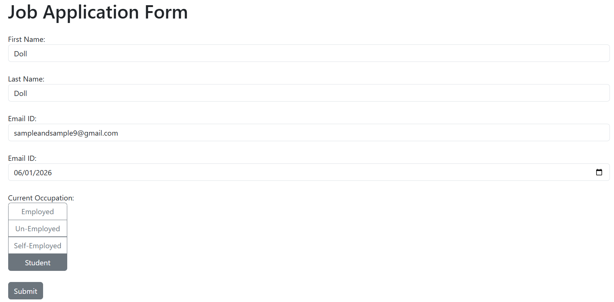

# Job Application Form - Flask Web Application


[](https://github.com/vinaykumarkv/Job_Application_Form_Flask)

A streamlined web application for job applications with database storage and email confirmation.

## 🚀 Features

- **User-Friendly Form**: Intuitive interface for job applicants
- **Persistent Storage**: SQLite database for all submissions
- **Email Confirmation**: Automated confirmation emails to applicants
- **Responsive Design**: Bootstrap-based mobile-friendly layout
- **Real-Time Validation**: Client-side form validation
- **Flash Messages**: User feedback with success/error notifications

## 🧰 Tech Stack

| Component       | Technology         | Purpose                          |
|----------------|--------------------|----------------------------------|
| Web Framework   | Flask              | Core application framework       |
| Database        | SQLite             | Local storage for application data |
| Email Service   | Flask-Mail + Gmail | Automated confirmation emails    |
| Styling         | Bootstrap 5        | Responsive UI components         |
| Environment     | .env               | Secure configuration management  |

## 🔧 Installation

Follow these steps to set up the application:

1. Clone the repository:
```bash
git clone https://github.com/vinaykumarkv/Job_Application_Form_Flask.git
cd Job_Application_Form_Flask
```

2. Create a `.env` file with your credentials:
```env
SECRET_KEY=your_strong_secret_key_here
MAIL=your_email@gmail.com
PASSWORD=your_gmail_app_password
```

> ⚠️ **Important**: For Gmail SMTP, you need to:
> - Enable [Less Secure Apps](https://myaccount.google.com/apppasswords) 
> - Or use an [App Password](https://myaccount.google.com/apppasswords)

3. Install dependencies:
```bash
pip install -r requirements.txt
```

## 🚦 Usage

1. Start the application:
```bash
python app.py
```

2. Access the application in your browser:
```
http://localhost:5001
```

3. Submit a job application form. You'll receive:
- A success message on the page
- An email confirmation with your application details

## 📦 Dependencies

| Package        | Version | Purpose                          |
|----------------|---------|----------------------------------|
| Flask          | 2.0+    | Web application framework        |
| Flask-SQLAlchemy | 3.0+    | Database ORM                     |
| Flask-Mail     | 0.10+   | Email integration                |
| Python-dotenv  | 1.0+    | Environment variable management  |
| Bootstrap      | 5.3.3   | UI framework                     |

## 📖 File Structure

```
job-application-flask/
├── app.py               # Main application logic
├── requirements.txt     # Dependency list
├── .env                 # Configuration (not committed)
├── templates/index.html # Application template
├── static/              # additional styling and resources
└── instance/data.db     # SQLite database file
```

## ⚠️ Important Notes

- **Security**: The application uses environment variables for sensitive data
- **Gmail Setup**: Requires:
  - Gmail account
  - App-specific password (for security)
  - Account enabled for less secure apps (or use App Passwords)
- **Database**: Uses SQLite for local storage (not for production)
- **Date Handling**: Uses ISO format for date submission

## 📬 Email Confirmation Flow

1. User submits application
2. Data saved to SQLite database
3. Confirmation email sent with:
   - Applicant's name
   - Submission date
   - Application status
4. Success flash message displayed

## 📜 Example Submission Confirmation

```
Thank you for your submission, John Doe!
Submitted as on 2023-06-15
Thank You
```

## 🤝 Contributing

Contributions are welcome! Please follow these steps:

1. Fork the repository
2. Create your feature branch (`git checkout -b feature/your-feature`)
3. Commit your changes (`git commit -m 'Add some feature'`)
4. Push to the branch (`git push origin feature/your-feature`)
5. Open a Pull Request

## 📄 License

Distributed under the MIT License. See [LICENSE](LICENSE) for more information.

---

> ⚠️ **Security Note**: This application is designed for educational purposes only. Never use Gmail credentials for production systems. Implement proper security measures (like HTTPS, password hashing, and rate limiting) before deployment.

  
